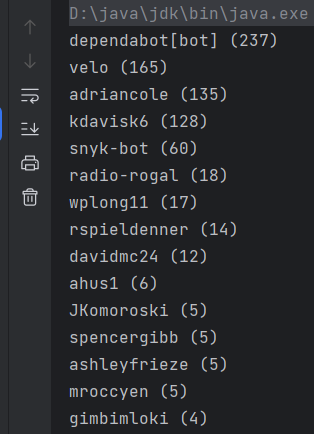

## Feign介绍

```
Feign 是一个声明式的、模板化的 HTTP 客户端库，它简化了通过 HTTP 协议进行服务间通信的开发   

Feign 提供了一种简洁的编程方式，使得开发者可以定义一个接口，通过注解来描述接口的方法以及与之对应的远程服务的调用。

Feign 底层使用了基于 HTTP 的 RESTful 服务，并提供了一些默认的编码器和解码器，使得开发者无需手动编写大量的网络请求代码，而只需要关注业务逻辑即可
```
以上来自chatGPT

feign使用起来非常简单，只需要定义接口，添加注解就可以实现http请求，spring将其封装在OpenFeign中，作为Spring Cloud体系比较重要的组件

让我们来学习一下feign的底层是如何实现的吧

## feign 源码

注意：这里的OpenFeign开源是[Feign](https://github.com/OpenFeign/feign)项目， 而不是SpringCloud开源[spring-cloud-openfeign](https://github.com/spring-cloud/spring-cloud-openfeign)项目

先clone项目

```shell
git clone git@github.com:OpenFeign/feign.git
```

项目当前版本是12.4-SNAPSHOT

可以看到有很多模块，项目代码来到5w+了

```
|-- core
|-- gson
|-- httpclient
|-- hc5
|-- hystrix
|-- jackson
|-- jackson-jaxb
|-- jackson-jr
|-- jaxb
|-- jaxb-jakarta
|-- jaxrs
|-- jaxrs2
|-- java11
|-- jakarta
|-- json
|-- okhttp
|-- googlehttpclient
|-- ribbon
|-- sax
|-- slf4j
|-- spring4
|-- soap
|-- soap-jakarta
|-- reactive
|-- dropwizard-metrics4
|-- dropwizard-metrics5
|-- kotlin
|-- micrometer
|-- mock
|-- apt-test-generator
|-- annotation-error-decoder
|-- example-github
|-- example-github-with-coroutine
|-- example-wikipedia
|-- example-wikipedia-with-springboot
|-- benchmark
```

为了方便学习，我们切换第一个分支`v1`, 后续都叫v1

```shell
git checkout -b v1 origin/1.x  # 从1.x切出一个本地分支v1
```

项目结构如下

```
.
|-- LICENSE                // Apache2.0许可
|-- build.gradle           // gradle构建
|-- codequality            // checkstyle（忽略）
|-- examples               // 演示项目
|-- feign-core             // feign核心表（重点学习）
|-- feign-ribbon           // ribbon支持
|-- gradle                 // 一些gradle脚本
|-- gradle.properties      // 一些gradle配置
`-- settings.gradle        // gradle聚合项目配置
```

由于feign是16年才转成maven管理依赖

### maven改造（可选）

gradle我用得不多，为了方便编译测试，所以改成了maven

篇幅问题，pom文件查看访问[feign-core 迁移到maven的pom文件](https://qaqrose.github.io/2023/07/03/feign-core-source-learn-1-maven-move/)

改造之后，结构如下

``` 
|-- examples             
|   `-- feign-example-cli
|-- feign-core           
|   |-- pom.xml
|   |-- src
|-- feign-ribbon
|   |-- pom.xml
|   |-- src
|-- pom.xml
```

### feign请求示例

在进入源码之前，我们通过官方一个简单例子学习一下

假设，我们想要查看某个github项目的贡献者有哪些

Github已经提供了[REST API]([Repositories - GitHub Docs](https://docs.github.com/en/rest/repos/repos?apiVersion=2022-11-28#list-repository-contributors))，所以我们可以直接获取


使用代码方式

新建代理接口Github类

```java
public interface GitHub {
    @GET
    @Path("/repos/{owner}/{repo}/contributors")
    List<Contributor> contributors(@PathParam("owner") String owner, @PathParam("repo") String repo);
}
```

Contributor类

``` java
public class Contributor {
    public String login;
    public int contributions;
}
```

测试类

``` java
public class GitHubExample {

    public static void main(String... args) {
        // <1> 新建代理接口
        GitHub github = Feign.create(GitHub.class, "https://api.github.com", new GsonModule());

        // <2> 调用代理方法（获取netflix的feign项目的贡献者列表）
        List<Contributor> contributors = github.contributors("netflix", "feign");
        for (Contributor contributor : contributors) {
            // 打印输出
            System.out.println(contributor.login + " (" + contributor.contributions + ")");
        }
    }

    @Module(overrides = true, library = true)  // dagger模块
    static class GsonModule {
        @Provides
        @Singleton
        Map<String, Decoder> decoders() {   // <3> 提供http响应解码器 
            return ImmutableMap.of("GitHub", jsonDecoder);
        }
	
        //  gson实现的json解码器
        final Decoder jsonDecoder = new Decoder() {
            Gson gson = new Gson();

            @Override
            public Object decode(String methodKey, Reader reader, TypeToken<?> type) {
                return gson.fromJson(reader, type.getType());
            }
        };
    }
}
```

输出



可以看到，我们通过像调用Java方法一样就可以实现远程调用

在<1>中，我们通过Feign创建了Github代理类，指定了代理类的请求域名地址，并提供了自定义模块GsonModule，在<3>中，GsonModule给Feign提供了解码器Decoder

然后就可以在<2>直接调用方法，成功发送了请求和解析了响应

#### dagger 学习

dagger是一个快速的依赖注入Java和Android框架

v1版本是由Square公司开源，Square不维护之后，由Google接手，目前是v2版本

这里使用的v1版本`1.0.1`


### feign-core  学习

feign-core项目现在还比较小巧，但是已经满足我们学习底层原理的需求了

看看结构

```
|-- main
|   `-- java
|       `-- feign
|           |-- Client.java						 // http客户端接口（内部类默认实现）
|           |-- Contract.java					 // contract协议层
|           |-- Feign.java					     // Feign抽象类，接口代理入口
|           |-- FeignException.java                // 异常
|           |-- MethodHandler.java			      // 类方法处理器（代理方法的调用）
|           |-- MethodMetadata.java			      // 方法元数据（地址、参数、返回类型等）
|           |-- ReflectiveFeign.java               // Feign的反射实现（唯一实现）
|           |-- Request.java					 // http请求封装
|           |-- RequestTemplate.java		      // http请求模板（用于构建请求Request）
|           |-- Response.java					 // http响应封装
|           |-- RetryableException.java            // 重试异常
|           |-- Retryer.java					 // 重试器
|           |-- Target.java						 // 代理对象Target
|           |-- Wire.java						 // 日志封装
|           `-- codec                              // 编码和解码
|			   |-- BodyEncoder.java               // http body编码器				
|               |-- Decoder.java                   // 解码器
|               |-- Decoders.java			      // 匹配解码器实现
|               |-- ErrorDecoder.java              // 错误解码器
|               |-- FormEncoder.java               // 表单解码器
|               |-- SAXDecoder.java                // SAX解码器
|               `-- ToStringDecoder.java           // 字符串解码器
`-- test
    `-- java
        `-- feign
            |-- ContractTest.java
            |-- DefaultRetryerTest.java
            |-- FeignTest.java
            |-- RequestTemplateTest.java
            |-- TrustingSSLSocketFactory.java
            |-- codec
            `-- examples
```


